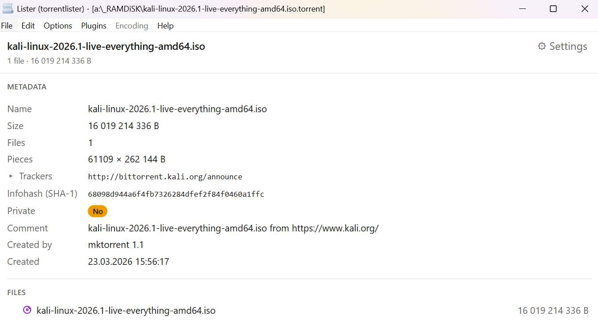
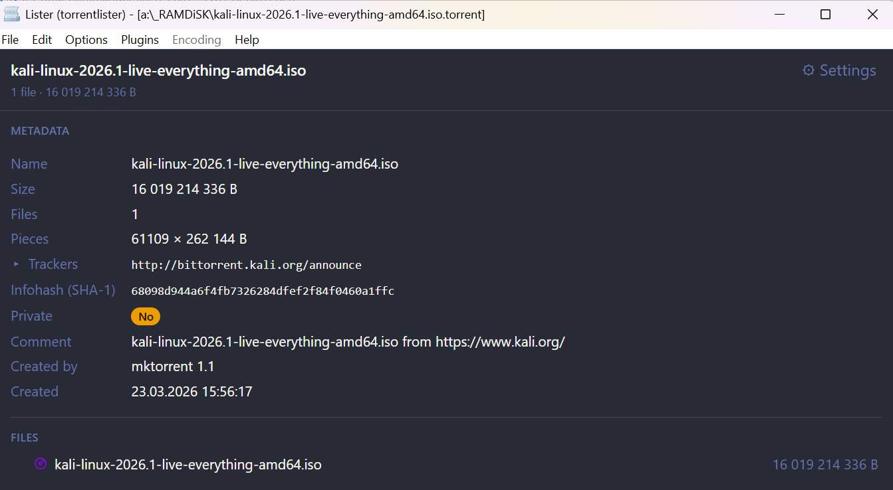
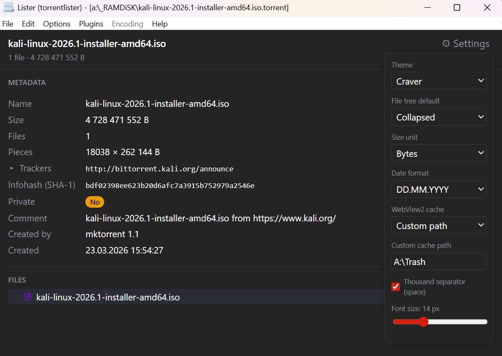
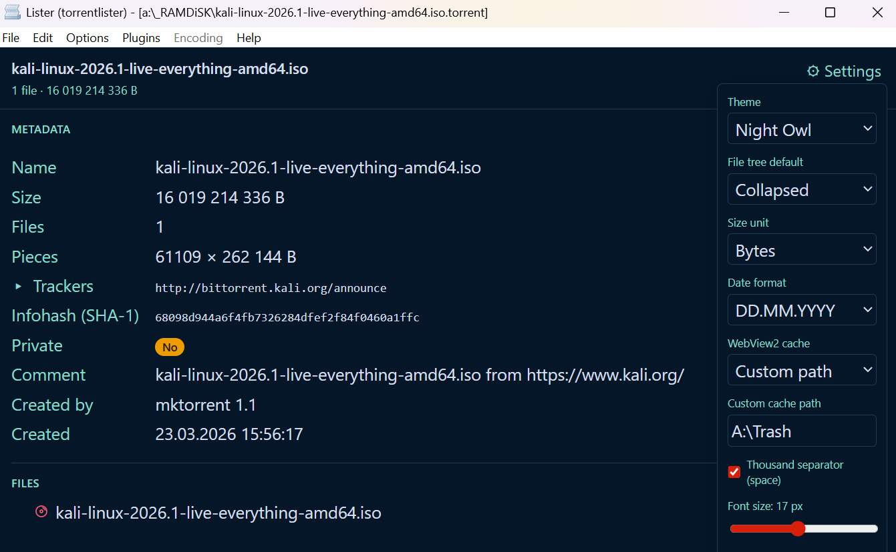

# TorrentLister WLX

TorrentLister WLX is a Total Commander Lister plugin for viewing `.torrent` files directly inside Total Commander.

It shows torrent metadata, trackers, hashes, private status, and the full file list in a clean WebView2 interface. It is a viewer only: it does not download files, announce to trackers, or contact the network.

## Screenshots

Light theme:

Dracula theme:

Settings:

Font size:

## Main Features

- Preview `.torrent` files with `F3` or Total Commander Quick View.
- View torrent name, total size, file count, piece count, trackers, creation date, creator, comment, private flag, and info hashes.
- Browse multi-file torrents as a folder tree.
- See common file types with built-in category icons.
- Supports common torrent metadata, including v1 and v2 info hashes where present.
- Works offline. The plugin never connects to trackers and never downloads anything.
- Handles unusual/non-UTF-8 torrent names without failing the preview.
- Remembers UI settings between sessions.
- Reuses the viewer between normal open/close/open usage for faster repeated previews.

## Themes

TorrentLister includes several built-in themes:

- Light
- Dark
- Dracula
- Night Owl
- Craver
- Catppuccin

The default `Auto` mode follows Total Commander dark/light mode where available.

Themes are editable through `themes.ini`, and any added theme section appears in the settings menu.

## Settings

The settings menu allows changing:

- Theme.
- Default file tree state: expanded or collapsed.
- Size unit: automatic, bytes, KB, MB, or GB.
- Digit grouping with spaces.
- Font size.
- Date format.
- WebView2 cache location.

Settings are saved in `TorrentLister.ini`.

## WebView2 Runtime

TorrentLister uses Microsoft Edge WebView2 for rendering.

Most modern Windows systems already include the WebView2 Runtime. If it is missing, install the Microsoft Edge WebView2 Evergreen Runtime from Microsoft.

## WebView2 Cache

WebView2 requires a writable cache/profile folder. This cannot be fully disabled.

TorrentLister supports three cache modes:

- Portable: stores `webview2_data` beside the plugin when possible.
- User directory: stores cache under `%LOCALAPPDATA%\TorrentLister\WebView2`.
- Custom path: uses a path selected by the user.

If the plugin folder is not writable, TorrentLister falls back to the user directory.

Cache location changes apply after restarting Total Commander.

## Installation

Install `TorrentLister.wlx64` as a Total Commander Lister plugin and associate it with `.torrent` files.

Manual installation:

1. Open Total Commander settings.
2. Go to `Configuration -> Options -> Plugins -> Lister plugins`.
3. Add `TorrentLister.wlx64`.
4. Associate it with the `torrent` extension.

After installation, select a `.torrent` file and press `F3`.

## Notes

- The plugin is read-only.
- No torrent data is uploaded.
- No tracker request is made.
- No remote UI assets are loaded.
- The interface is stored inside the plugin file.
